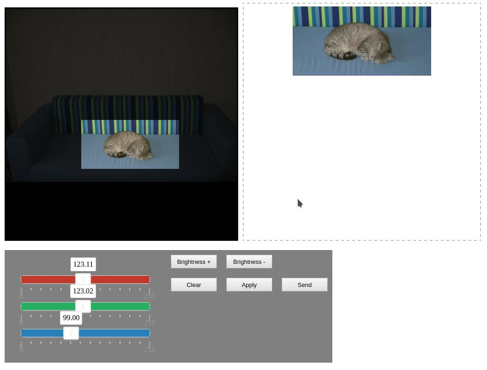

# PCCP

Crop and adjust image colors into a browser



Clone this repo and open demo.html for a try

## API

#### Usage

```js

<script type="text/javascript">
  document.addEventListener("DOMContentLoaded", () => pccp.init({
    output: {
      w:300,
      h:150
    },
    board: {
      side: 500
    }
  }));
</script>

```
